# Quinzical User Manual

---

This application is intended for the educational development of Young Adults (18-25 years old), who have recently moved to New Zealand and want to
improve their knowledge about the country.

# Table of Contents
* [Launching](#launching)
  * [Set up](#set-up)
  * [Running the application](#running-the-application)
* [Logging in](#logging-in)
* [Main Menu](#main-menu)
* [Gameplay types](#gameplay-types)
  * [Online play](#online-play)
  * [Local play](#local-play)
  * [Offline mode](#offline-mode)
* [Game Module](#game-module)
  * [International Section](#international-section)
  * [Reward Screen](#reward-screen)
* [Practice Module](#practice-module)
* [Leaderboard](#leaderboard)
* [Adding questions](#adding-questions)
* [Customisation](#customisation)
* [Chat](#chat)
* [Statistics](#statistics)
* [Help](#help)
* [Settings](#settings)

<div class="page-break"></div>

# Launching

---

## Set Up

The application was intended for Linux Ubuntu 20.04.1 but also works on Windows and MacOS operating systems.

Java Run Time used was Java 14 to build the project and should also be used to run it. 

Recommended installed packages:
* espeak installed (for TTS support)
* JavaFX 11 sdk installed
* Java installed (Java 14 recommended)

## Running the application
Open the terminal and run the script Quinzical.sh using the following command:
```./Quinzical.sh```

<div class="page-break"></div>

# Logging in

---

Upon opening the application, you will be presented with the login screen. This allows you to login using an exisiting account or register a new account. 

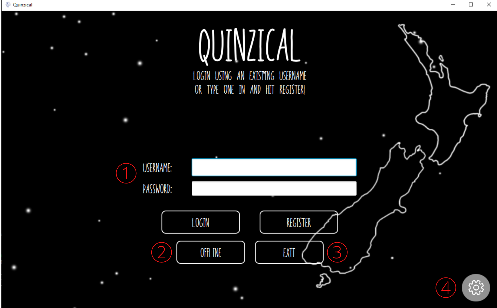

**1. Login fields**
Use the username and password fields to login using your existing account or create a new one. 
***When logging in:***
If you entered the correct details for your login you will be taken to the main menu.  
If you entered the incorrect details for your username, you will be notfied and asked to enter your details again.  
***When registering a new account:***
If you entered a username that has already been taken by another user, you will be notfied and asked to pick another one. 
If your password is less than 6 characters long, you will be notifed and asked to enter another one with at least 6 characters.  
***Server error:***
If there is an error connecting to the server, you will be notifed that an internal error has occurred. If so, please check your internet connection and ensure that it is working.  

**2. Offline mode**
Use this button to play the game when you do not have an internet connection. For this section, you are able to access the games and practice module without logging in but are not able to save your score as a user. See [offline mode](#offline-mode) for more. 

**3. Exit**
This allows you to leave the game. You will be asked to confirm your decision and the game window will close on confirmation. 

**4. Settings**
This button will take you to the settings screen. See [settings](#settings) for more. 

<div class="page-break"></div>

# Main Menu

---

The main menu is where you can access the different types of gameplay. 

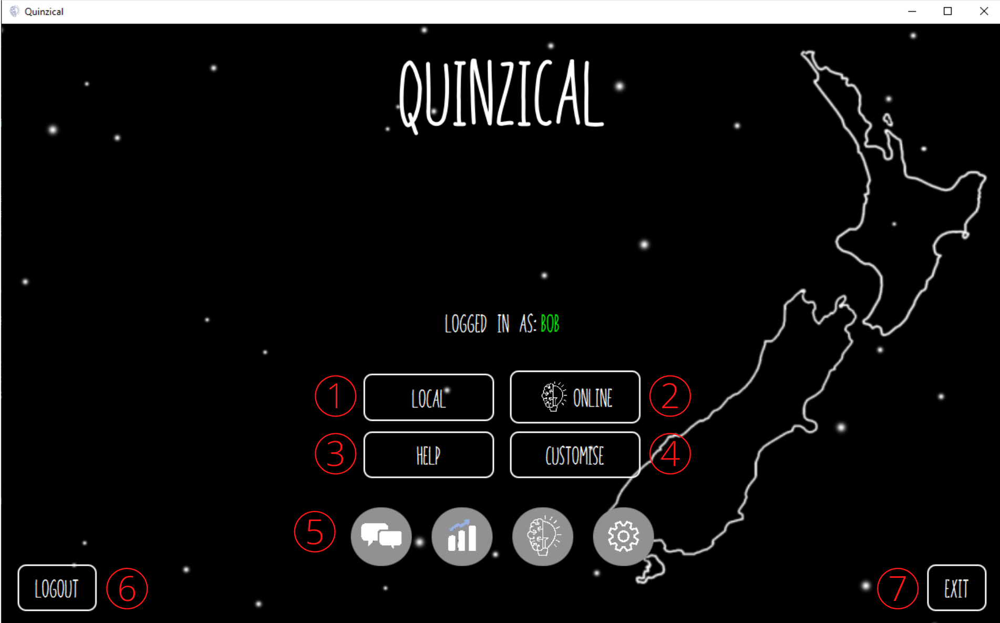

**1. Local play**
This button will allow you to play locally and not against other players. See [local play](#local-play) for more. 

**2. Online play**
This button will take you to online gameplay where you can either host or join lobbies. See the [online play section](#online-play) for more. 

**3. Help**
This will take you to the [help screen](#help) and will let you know details about the game. 

**4. Customise**
This will take you to the [customise](#customise) screen where you can customise your gameplay character. 

**5. Special buttons**

***5.1 Chat***
Clicking this icon allows you to chat with other online players. See [chat](#chat) for more. 

***5.2 Statistics***
Clicking this icon allows you to view your game stats, from both your latest and previous games. See [statistics](#stats) for more. 

***5.3 Info***
Clicking this icon will bring you a pop-up with all the details about the team that brought you Quinzical. 

***5.4 Settings***
Clicking this icon allows you to view and modify the game [settings](#settings).

**6. Logout**
This allows you to logout of the current account.

**7. Exit**
This allows you to leave the game. You will be asked to confirm your decision and the game window will close on confirmation. 

<div class="page-break"></div>

# Gameplay types

---

In quinizcal, there are three differing types of gameplay avaiable to the user. These include local play, online play and offline play. All gameplay requires an internet connection apart from offline play. 

## Local play

Playing locally allows you to play individually on both the practice and games modules. 

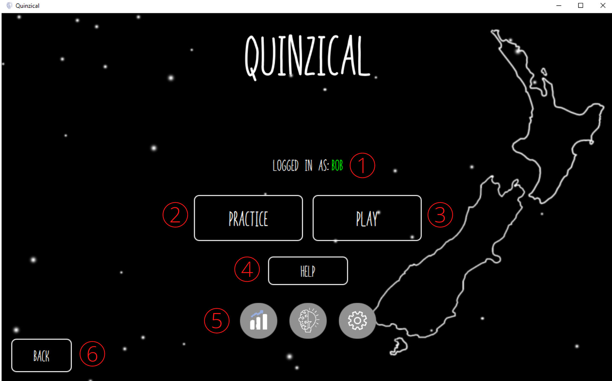

**1. Username**
The green text shows you the current user that is logged in. In this case, the user is "Bob".

**2. Practice**
This will take you to the practice module, where your score is not counted and you can practice any question from the New Zealand set of questions. See the [practice module section](#practice-module) for more. 

**3. Play**
This will take you to the games module, where your score is counted and recorded on both the local and global leaderboards. See the [game module](#game-module) amd [leaderboard](#leaderboard) sections for more. 

**4. Help**
This will take you to the [help screen](#help) and will let you know details about the game. 

**5. Special buttons**

***5.1 Statistics***
Clicking this icon allows you to view your game stats, from both your latest and previous games. See [statistics](#stats) for more. 

***5.2 Info***
Clicking this icon will bring you a pop-up with all the details about the team that brought you Quinzical. 

***5.3 Settings***
Clicking this icon allows you to view and modify the game [settings](#settings).

**6. Back** 
The back button will take you back to the previous screen. 

<div class="page-break"></div>

## Online play

Online play allows to to either host, find or join a current lobby. Note that you can only join a game before it has started.

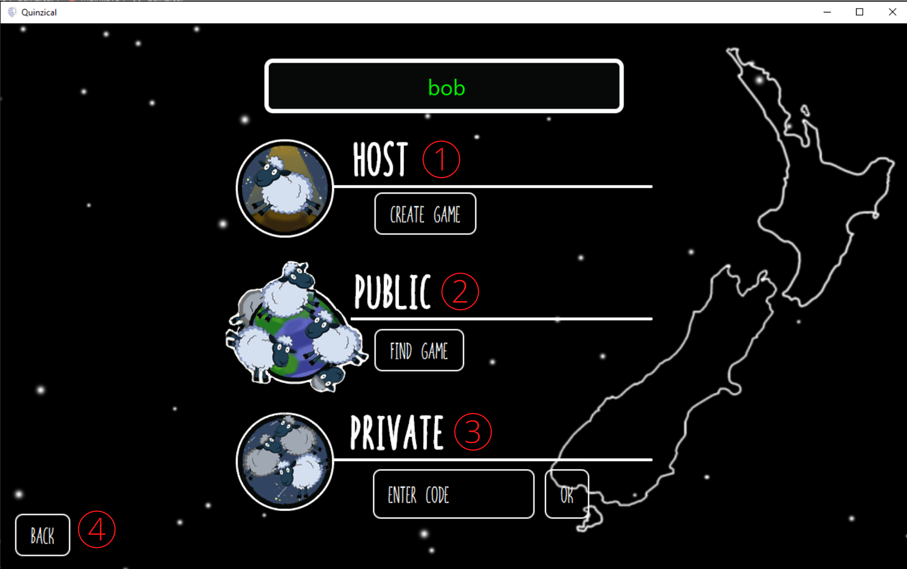

**1. Host**
Hosting a game means that you create a game and pick the game settings. You can share the QR code with others so that other players can join your game. See [hosting a game](#hosting-a-game) for more. 

**2. Public**
This allows you to find any current running public game and join the lobby. 

**3. Private**
This allows you to join any current running private game. Enter the game code in the text field and you will be able to join that game lobby. 

**4. Back** 
The back button will take you back to the previous screen. 

<div class="page-break"></div>

### Online gameplay
Online gameplay involves answering randomly chosen questions from a set of New Zealand or International questions in a given timeframe. The types and time allocated to questions is specified by the host when creating the game. 

### Hosting a game
When hosting a game, you are able to choose features of the gameplay.

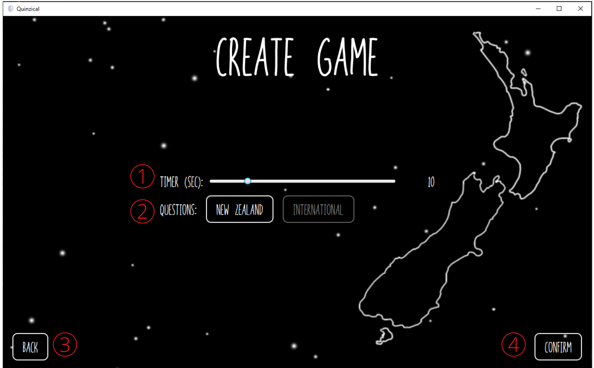

**1. Timer**
Using this slider, you can select the duration that players will have to answer questions. The minimum amount of time is 5 seconds and the maximum is 30 seconds. The default value is 10 seconds. 

**2. Questions**
Here, you are able to select either the New Zealand or International question banks. Questions will randomly be selected from these question banks.

**3. Back** 
The back button will take you back to the previous screen. 

**4. Confirm**
This allows you to confirm your chosen online gameplay settings.

<div class="page-break"></div>

### Online lobby
The online lobby is where users wait for a particular online game to start.

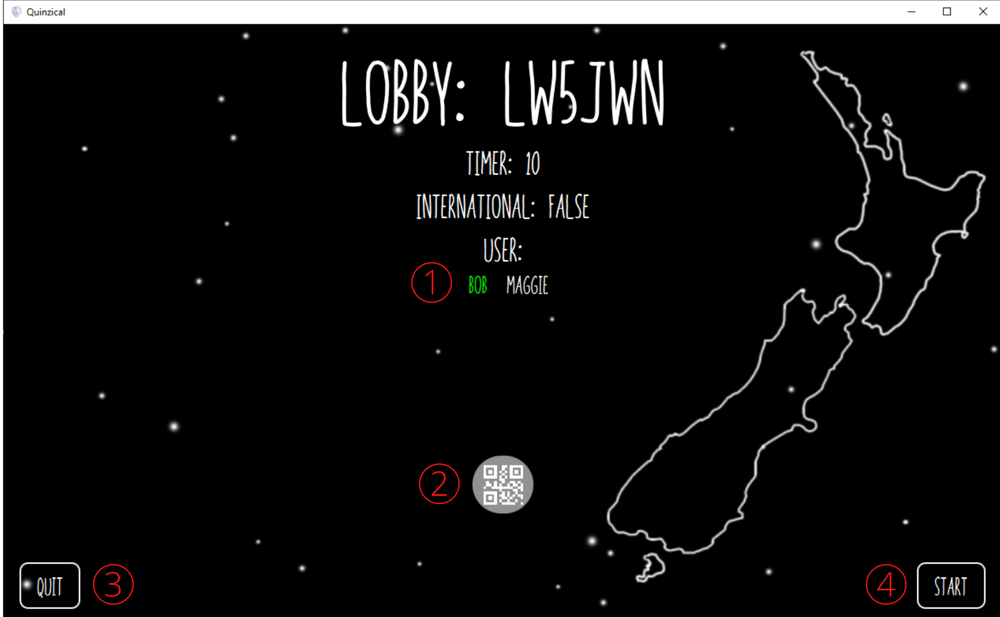

**1. Participants**
This shows all the current users in the lobby.

**2. QR Code**
This brings up a pop-up with the game QR code so mobile users can easily connect to the web application.

**3. Quit**
This allows you to quit online gameplay.

**4. Start**
This allows you to start the online game. Please note that at least one other user must be in the lobby.

<div class="page-break"></div>

### Online questions
Online questions are randomly generated from the hosts chosen database. 

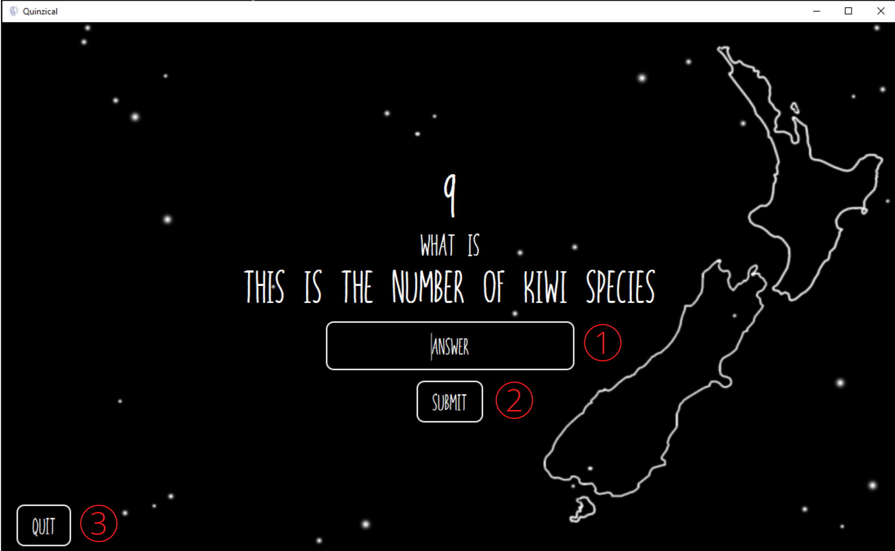

**1. Answer field**
Enter your answer here.

**2. Submit**
Use this button to confirm your answer before time runs out. 

**3. Quit**
This allows you to quit online gameplay.

<div class="page-break"></div>

## Offline play

Quinzical also gives you the opportunity to play offline when you do not have access to internet. There is no leaderboard or games module available as these require you to login, which needs the internet. 

Therefore, the only gameplay available offline is the [practice module](#practice-module). 

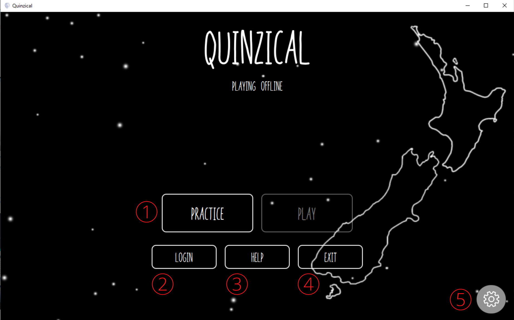

**1. Practice Module**
This allows you to play the [practice module](#practice-module) while offline. 

**2. Login**
This takes you to the [login screen](#logging-in).

**3. Help**
This will take you to the [help screen](#help) and will let you know details about the game. 

**4. Exit**
This allows you to leave the game. You will be asked to confirm your decision and the game window will close on confirmation. 

**5. Settings**
Clicking this icon allows you to view and modify the game [settings](#settings).

<div class="page-break"></div>

# Practice Module

---

The practice module allows you to answer random questions from any category you chose. There is no point system for these questions.

The practice module allows you to pick a category to answer questions from, as shown below.

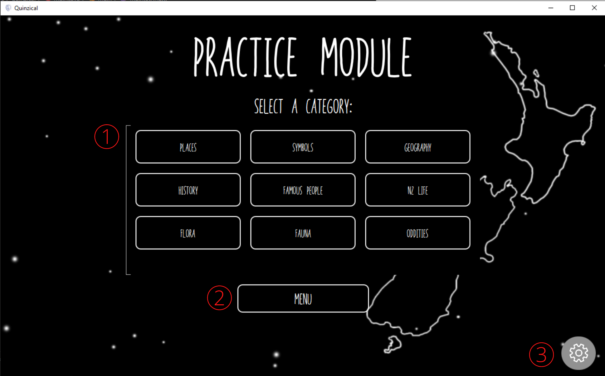

**1. Select a category**
Select a category of your choice.

**2. Menu**
This will take you to the previous menu screen. 

**3. Settings**
Clicking this icon allows you to view and modify the game [settings](#settings).

<div class="page-break"></div>

## Answering a practice question

After selecting a category, you will be presented with a random question from the category. The question is both displayed as text and spoken to the user. When answering a question, you have three attempts to get it correct in the practice module. On the third attempt, you will be given the first letter of the answer as a clue. After answering a question, you will be able to select a different category. 

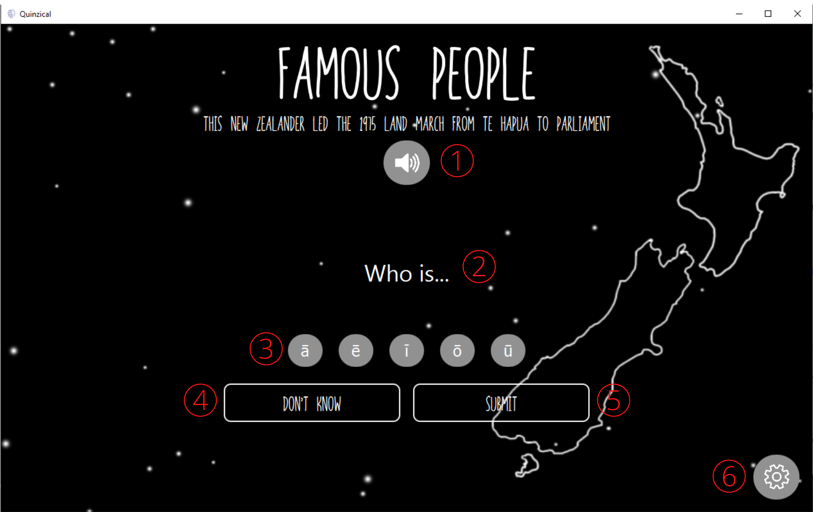

**1. Speak button**
This allows you to play the question aloud again if needed. 

**2. Answer field**
This is where you can write your answer for the current question.  

**3. Macron buttons**
Use these buttons to insert Maori macrons if you do not have the Maori keyboard installed. 

**4. Don't know**
If you are unsure of the answer to a question you can select the don't know button. You will automatically be taken to the third attempt and given the clue for the question.

**5. Submit**
Use this button to confirm your answer. 

**6. Settings**
Clicking this icon allows you to view and modify the game [settings](#settings).

<div class="page-break"></div>

# Games Module

---

The games module allows you to answer random questions from chosen categories for points ranging between \$100 and \$500. As your score changes, you may notice that your position on the local leaderboard may change. This is because this is constantly updated. However, your score will only be visible upon finishing the games module will be recorded on the [global leaderboard](#global-leaderboard). 

After answering two categories, regardless of the score, the [international section](#international-section) will become unlocked. 


The games module allows you to select five categories from a selection as shown below. 

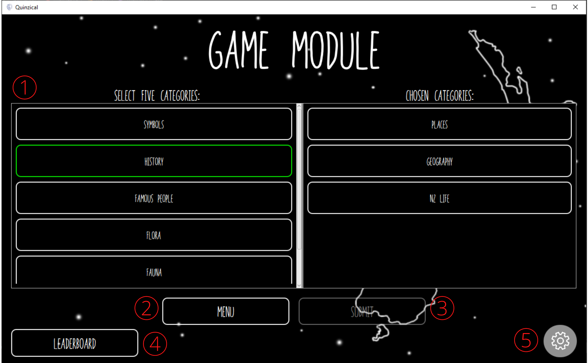

**1. Select categories**
Select five categories of your choice.

**2. Menu**
This will take you to the previous menu screen. 

**3. Submit**
This confirms your five chosen categories. 

**4. Leaderboard**
This brings up a pop-up with the option to view the local or global leaderboard. See [leaderboard](#leaderboard) for more. 

**5. Settings**
Clicking this icon allows you to view and modify the game [settings](#settings).

<div class="page-break"></div>

After selecting five categories, you will be presented with five random questions from each category, worth increasing value ranging from \$100 to \$500. You are only able to answer the lowest value question from each category at a time. Upon answering a question, if it was answered correctly, the value of the question will be added to your score and the question button will be disabled but green. If answered incorrectly, your score will remain the same and the question button will be disabled but red. 

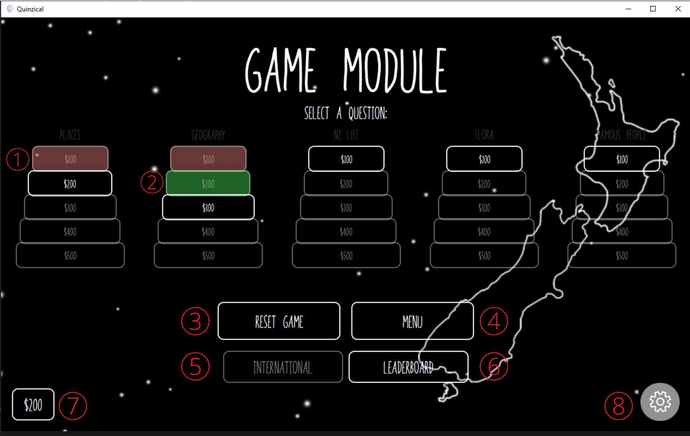

**1. Correct**
This is an example of a previously answered question that was correct.

**2. Incorrect**
This is an example of a previously answered question that was incorrect. 

**3. Reset game**
This allows you to reset the game. Your final score before resetting will be sent to the global leaderboard and now visible. 

**4. Menu**
This will take you to the previous menu screen. 

**5. International**
If you have answered two categories, this will become unlocked, and take you to the [international section](#international-section). Here, two categories have not been answered so the button is disabled. 

**6. Leaderboard**
This brings up a pop-up with the option to view the local or global leaderboard. See [leaderboard](#leaderboard) for more. 

**7. Score**
This displays your current score. 

**8. Settings**
Clicking this icon allows you to view and modify the game [settings](#settings).

<div class="page-break"></div>

## Answering a game question

When answering a game question, you only have one try. The question is only spoken to the user. 

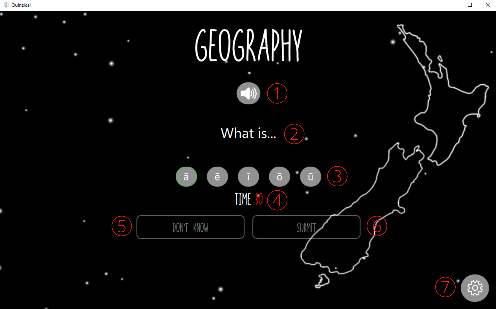

**1. Speak button**
This allows you to play the question aloud again if needed. 

**2. Answer field**
This is where you can write your answer for the current question. The field is disabled until the question has finished being spoken for the first time. 

**3. Timer**
This is the countdown timer. It starts after the question has been spoken for the first time. You will have 30 seconds to answer each question. If you do not submit your answer before the time runs out, your current answer will be sumbitted. 

**4. Macron buttons**
Use these buttons to insert Maori macrons if you do not have the Maori keyboard installed. 

**5. Don't know**
If you are unsure of the answer to a question you can select the don't know button. Your score will remain the same and the question will be marked as incorrectly answered. This button is disabled while the question is being spoken for the first time. 

**6. Submit**
Use this button to confirm your answer before time runs out. This button is disabled while the question is being spoken for the first time. 

**7. Settings**
Clicking this icon allows you to view and modify the game [settings](#settings).

<div class="page-break"></div>

## International Section

The international section provides you with randomly generated questions from an external api, [jservice.io](https://jservice.io/). 

If you answer the question correctly, the value of that question will be added to your game module score. The value of each question is determined by the external service. If you answer the question incorrectly, your score will remain the same.

Answering a question is just the same as the [games module](#answering-a-game-question) without the timer. 

Upon answering the question you will be presented with the following screen:

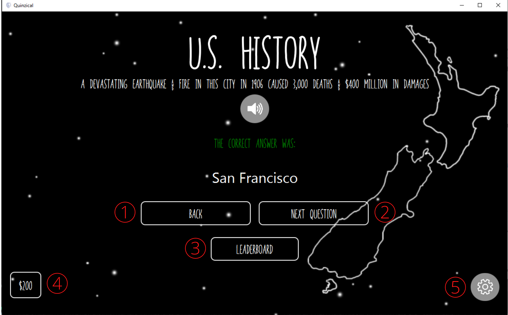

**1. Back**
The back button will take you back to the previous screen. 

**2. Next Question**
This allows you to generate another random question from the international question bank. 

**3. Leaderboard**
This brings up a pop-up with the option to view the local or global leaderboard. See [leaderboard](#leaderboard) for more. 

**4. Score**
This displays your current score. 

**5. Settings**
Clicking this icon allows you to view and modify the [game settings](#settings).

<div class="page-break"></div>

## Reward screen

Upon answering all the available questions in the games module, you will be presented with a reward screen which displays your final score. Note that after completing the games module the international section is no longer avaliable. You must reset the game inside the reward screen. 

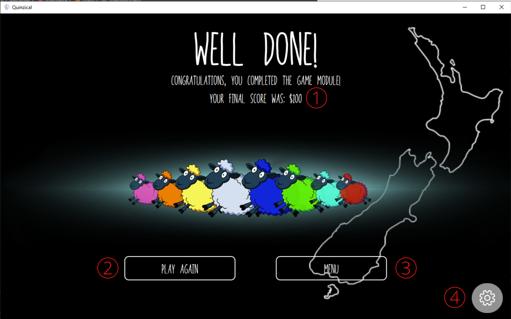

**1. Final score**
This is your final score after completing the games module and potentially asking international questions.

**2. Play again**
This allows you to play the games module again, by resetting your chosen categories. 

**3. Menu**
This will take you back to the local gameplay menu. 

**4. Settings**
Clicking this icon allows you to view and modify the [game settings](#settings).

<div class="page-break"></div>

# Leaderboard

---

When choosing to view the leaderboard, you will be presented with two options, asking you if you would like to view the local or global leaderboards.

## Local leaderboard
The local leaderboard allows you to compare your scores to those of users on the same device as you. The information is retrived from a local database, which contains information that is unique to each device. 

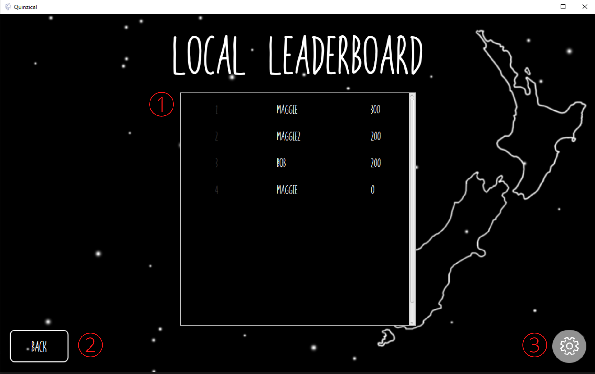

**1. Ranking**
This is the ranking of all the players of Quinzical only pn your current device. The person with the highest score is in first place.  

**2. Back** 
The back button will take you back to the previous screen. 

**3. Settings**
Clicking this icon allows you to view and modify the [game settings](#settings).


<div class="page-break"></div>

## Global leaderboard
The global leaderboard allows you to compare your scores to those of all other users who play Quinizcal. This means you can compare your score to users who do not play on the same device as you.

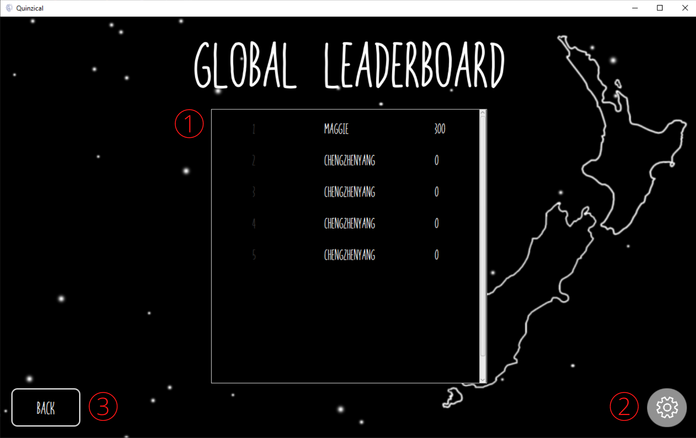

**1. Ranking**
This is the ranking of all the players of Quinzical on any device. The person with the highest score is in first place.  

**2. Settings**
Clicking this icon allows you to view and modify the [game settings](#settings).

**3. Back** 
The back button will take you back to the previous screen. 

<div class="page-break"></div>

# Adding questions

---

In order to add your own question, first ensure that the quinzical.txt file is in the exact same directory from which you are running the game. Then, simply add your new question to any of the existing categories by appending it as a new line underneath the previous question. 

Please ensure that your new question is in the format:

```This is the question\ (What is) the answer```

The 'What is' encased in the brackets can be anything, but the prefix, i.e. 'Who is', to the question must be encased in brackets. 

Below is an example of adding a question, where the red underlined line is the new question being added:

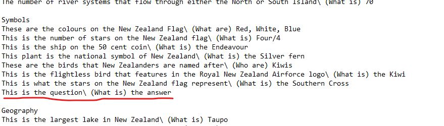

Then simply start the game again and your question will be available!

<div class="page-break"></div>

# Customisation

---

The customisation menu allows you to change the colour of your sheep. 

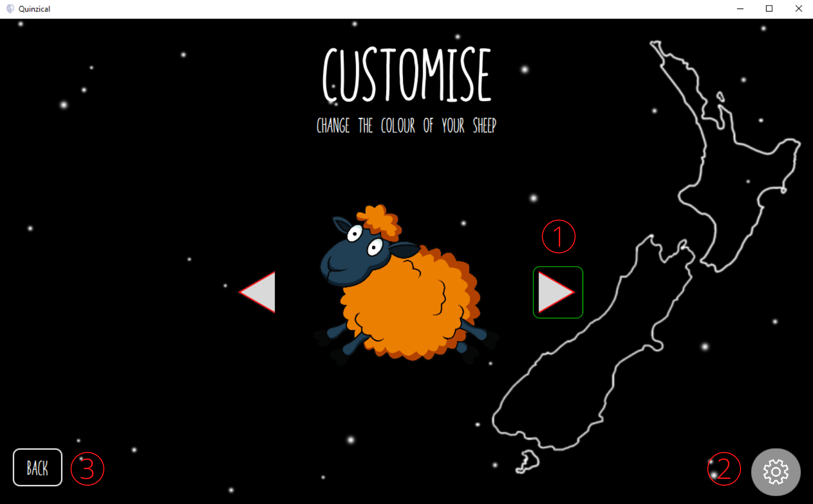

**1. Arrow buttons**
Press the left or right arrows to sift through the different colours. Upon leaving this menu, the last colour of the sheep on the screen will be saved as your new Sheep look. 

**2. Back** 
The back button will take you back to the previous screen. 

**3. Settings**
Clicking this icon allows you to view and modify the [game settings](#settings).

<div class="page-break"></div>

# Chat

---

The chat menu allows you to chat and interact with other players who play Quinzical, on any device. 

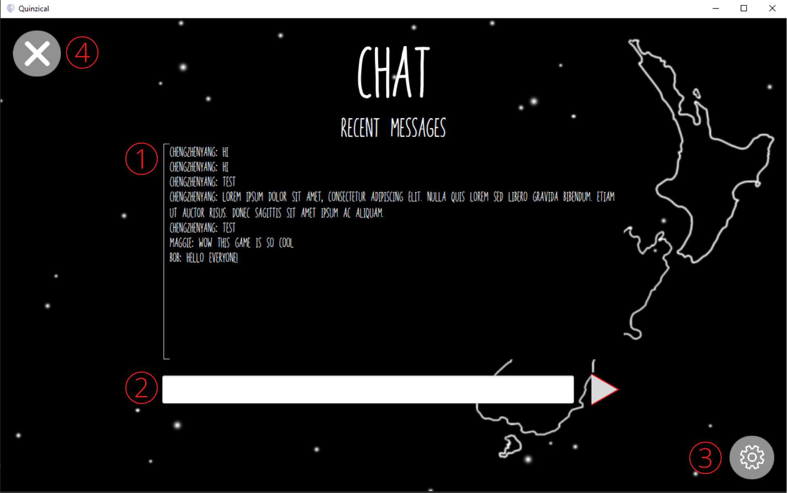

**1. Chat box**
This displays recent messages from you and other users.

**2. Chat field** 
This allows you to type messages to other users. Hit the arrow button to the right of the chat field or enter to send a message. 

**3. Settings**
Clicking this icon allows you to view and modify the [game settings](#settings).

**4. Back** 
The back button will take you back to the previous screen.

<div class="page-break"></div>

# Statistics

---

The statistics menu allows you to view your stats from previous games

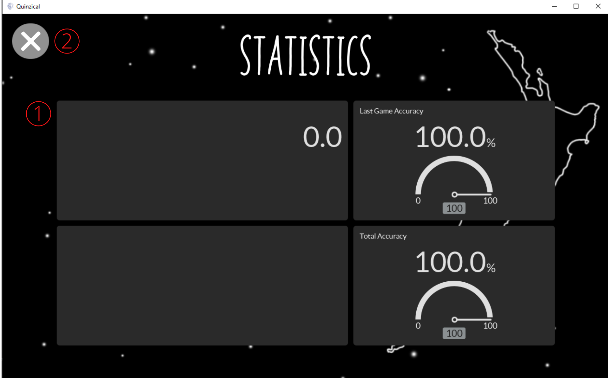


**1. Graphs**
These graphs will display your stats from the game such as last game accuracy and total accuracy after completing the game module.

**2. Back** 
The back button will take you back to the previous screen. 

<div class="page-break"></div>

# Help

---

The help screen aims to give you information about the game, in game so you do not need to constantly refer to this user manual. 

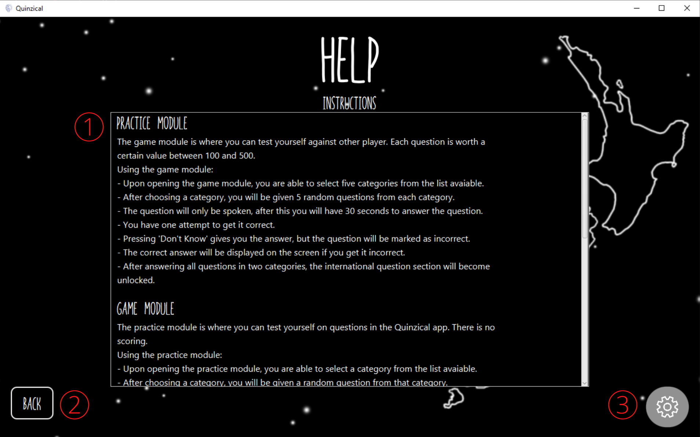

**1. Information**
This gives you in-game help about the different features of the game. 

**2. Back** 
The back button will take you back to the previous screen. 

**3. Settings**
Clicking this icon allows you to view and modify the [game settings](#settings).

<div class="page-break"></div>

# Settings

---

The settings menu allows you to change the volume and speed of the text-to-speech used for sounding out questions. Default values are shown in light blue, while all other values are shown in light purple. 

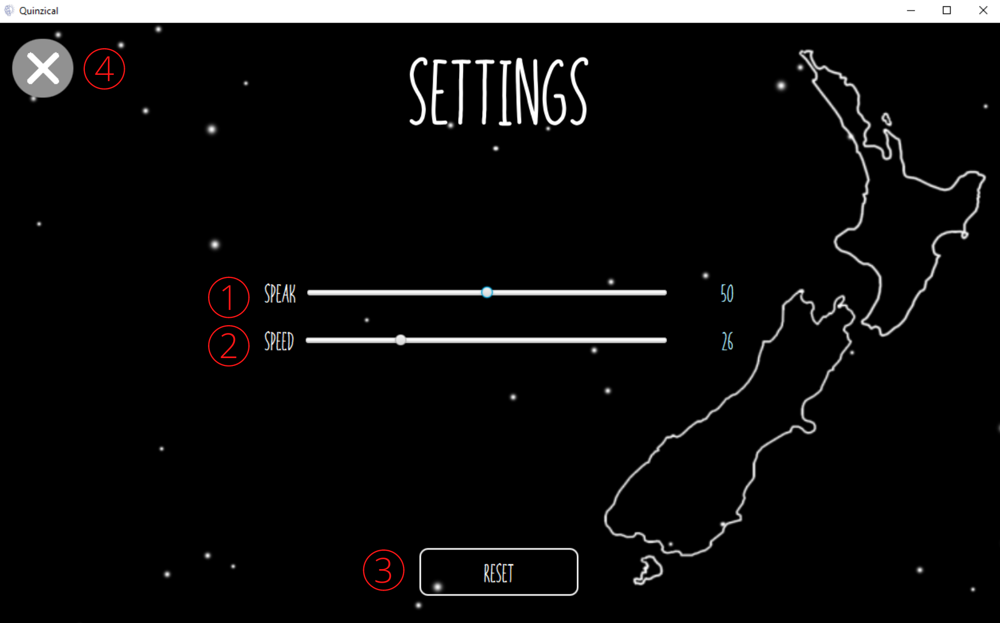

**1. Speak Slider**
Moving this slider will allow you to change the volume of the text to speech. The default value is 50. 

**2. Speed Slider**
Moving this slider will allow you to change the speed of the text to speech. The default value is 26, which represents an espeak speed of 175 words per minute (wpm). The lower limit of zero represents a speed of 80 wpm and the upper limit of 100 represents a speed of 440 wpm. 

**3. Reset**
This allows you to reset the Speak (Volume) and Speed sliders back to their default values, 50 and 26 respectively. 

**4. Back** 
The back button will take you back to the previous screen. 

